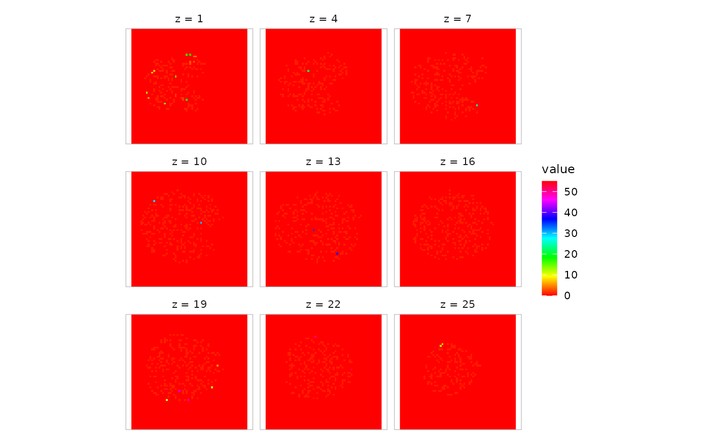
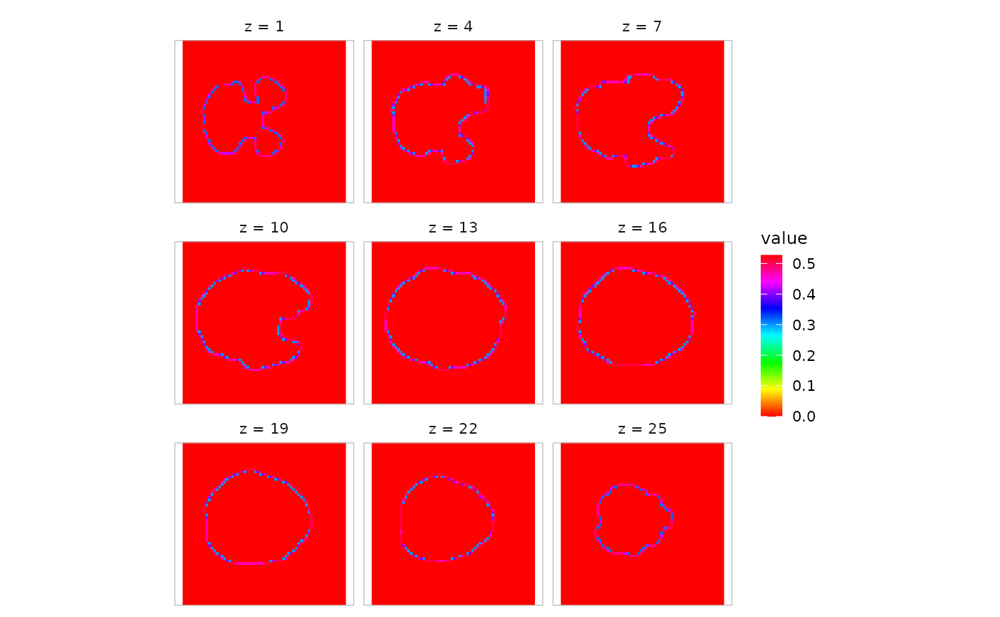
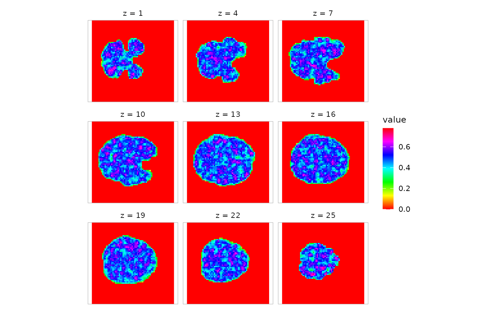
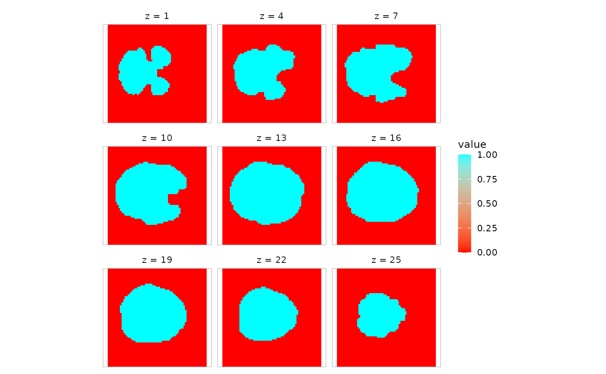

# Pipelines: Split, Map, and Reduce

## Pipelining operations using a functional approach

The `neuroim2` packages provides a set of functions that allows one to
split image data in various ways to processing data split into parts. By
breaking a dataset up into pieces, we can also more easily parallelize
certain operations.

### Splitting an image into connected components

First we load in an example volume, assign it random values, and find
its connected components with a threshold of .9

``` r
      library(purrr)
      library(ggplot2)
      file_name <- system.file("extdata", "global_mask_v4.nii", package="neuroim2")
      vol <- read_vol(file_name)
      mask.idx <- which(vol>0)
      
      vol2 <- vol
      vol2[mask.idx] <- runif(length(mask.idx))
      comp <- conn_comp(vol2, threshold=.8)
      
      plot(comp$index, zlevels=seq(1,25,by=3), cmap=rainbow(255))
```



Now we want to find the average value in each of the connected
components using the `split_clusters` function. Since `conn_comp`
returns a `ClusteredNeuroVol` containing the cluster indices, we use
that to split the original volume into a list of `ROIVol`s and compute
the mean over each one.

``` r
mvals <- vol2 %>% split_clusters(comp$index) %>% map_dbl( ~ mean(.))
```

Suppose we want to compute the local standard deviation within a 4mm
radius of each voxel. We can use the `searchlight` function to construct
a list of spherical ROIs centered on every voxel in the input set.

``` r
sdvol <- vol %>% searchlight(radius=5, eager=TRUE) %>% map_dbl( ~ sd(values(.))) 
sdvol <- NeuroVol(sdvol, space=space(vol), indices=which(vol!=0))
plot(sdvol, cmap=rainbow(255))
```



Another thing we might to is compute the k nearest neighbors in each
searchlight and replace the center voxel with the average intensity of
its neighbors:

``` r
k <- 12
knnfvol <- vol2 %>% searchlight(radius=6, eager=TRUE) %>% map_dbl(function(x) {
  # Just compute mean of all values in the searchlight
  mean(values(x))
}) %>% NeuroVol(space=space(vol), indices=which(vol!=0))
plot(knnfvol, cmap=rainbow(255))
```



If we only need access to the searchlight coordinates (in voxel space),
we can use the `searchlight_coords` function. Here, we simply replace
the center voxel with the average of its neighbors in searchlight space:

``` r
avgvol <- vol %>% searchlight_coords(radius=12, nonzero=TRUE) %>% map_dbl(function(x) {
  vals <- vol[x]
  mean(vals[vals!=0])
}) %>% NeuroVol(space=space(vol), indices=which(vol!=0))
plot(avgvol, cmap=rainbow(2), zlevels=seq(1,25,by=3))
```



### Mapping a function over every slice of a `NeuroVol`

Suppose we want to split up an image volume by slice and apply a
function to each slice. We can use the `slices` function to achieve this
as follows:

``` r
slice_means <- vol %>% slices %>% map_dbl(~ mean(.))
plot(slice_means, type='l', ylab="mean intensity", xlab="slice number")
```


### Mapping a function over each volume of a `NeuroVec` object

``` r
vec <- concat(vol,vol,vol,vol,vol)
vec
#> <DenseNeuroVec> [3.9 Mb] 
#> ── Spatial ───────────────────────────────────────────────────────────────────── 
#>   Dimensions    : 64 x 64 x 25 (5 timepoints)
#>   Spacing       : 3.5 x 3.5 x 3.7
#>   Origin        : 112, -108, -46.2
#>   Orientation   : LAS
#> ── Data ──────────────────────────────────────────────────────────────────────── 
#>   Mean +/- SD   : 0.288 +/- 0.453 (t=1)
#>   Label         : none
mean_vec <- vec %>% vols %>% map_dbl(~ mean(.))
sd_vec <- vec %>% vols %>% map_dbl(~ sd(.))
stopifnot(length(mean_vec) == dim(vec)[4])
stopifnot(length(sd_vec) == dim(vec)[4])
```

### Mapping a function over each vector of a `NeuroVec` object

``` r
vec <- concat(vol,vol,vol,vol,vol)
vec
#> <DenseNeuroVec> [3.9 Mb] 
#> ── Spatial ───────────────────────────────────────────────────────────────────── 
#>   Dimensions    : 64 x 64 x 25 (5 timepoints)
#>   Spacing       : 3.5 x 3.5 x 3.7
#>   Origin        : 112, -108, -46.2
#>   Orientation   : LAS
#> ── Data ──────────────────────────────────────────────────────────────────────── 
#>   Mean +/- SD   : 0.288 +/- 0.453 (t=1)
#>   Label         : none
mean_vol <- vec %>% vectors() %>% map_dbl(~ mean(.)) %>% NeuroVol(., space=space(vol))
stopifnot(all(dim(mean_vol) == dim(vol)))
```
