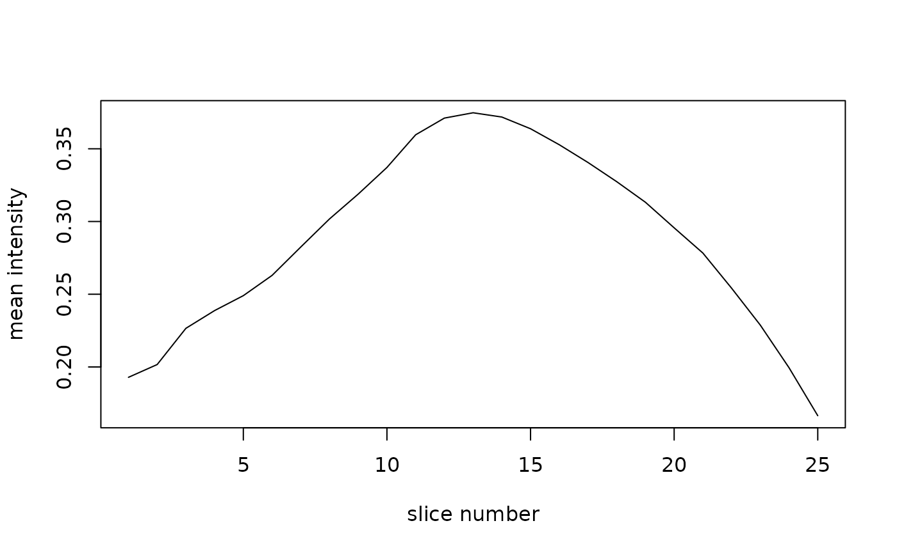

# Advanced Split, Map, and Reduce

This article is now the older, lower-level companion to
[`vignette("AnalysisWorkflows")`](https://bbuchsbaum.github.io/neuroim2/articles/AnalysisWorkflows.md).
Read that vignette first if you want the shortest path to ROI
extraction, searchlights, and split-map-reduce patterns. Use this
article when you want more raw examples of composing those operations
with `purrr` and direct list-processing.

## Pipelining operations with a functional style

`neuroim2` exposes several operations that split an image into pieces,
let you map a function over those pieces, and then reduce the results
back into a vector, list, or derived image.

The ROI- and searchlight-based split-map-reduce patterns now live in
[`vignette("AnalysisWorkflows")`](https://bbuchsbaum.github.io/neuroim2/articles/AnalysisWorkflows.md).
This article keeps the lower-level iteration helpers that are still
useful when you want to split by slices, volumes, or voxel vectors
directly.

``` r

file_name <- system.file("extdata", "global_mask_v4.nii", package = "neuroim2")
vol <- read_vol(file_name)
```

### Mapping a function over every slice of a `NeuroVol`

Suppose we want to split up an image volume by slice and apply a
function to each slice. We can use the `slices` function to achieve this
as follows:

``` r

slice_means <- vol %>% slices %>% map_dbl(~ mean(.))
plot(slice_means, type='l', ylab="mean intensity", xlab="slice number")
```



### Mapping a function over each volume of a `NeuroVec` object

``` r

vec <- concat(vol,vol,vol,vol,vol)
vec
#> <DenseNeuroVec> [3.9 Mb] 
#> ── Spatial ───────────────────────────────────────────────────────────────────── 
#>   Dimensions    : 64 x 64 x 25 (5 timepoints)
#>   Spacing       : 3.5 x 3.5 x 3.7
#>   Origin        : 112, -108, -46.2
#>   Orientation   : LAS
#> ── Data ──────────────────────────────────────────────────────────────────────── 
#>   Mean +/- SD   : 0.288 +/- 0.453 (t=1)
#>   Label         : none
mean_vec <- vec %>% vols %>% map_dbl(~ mean(.))
sd_vec <- vec %>% vols %>% map_dbl(~ sd(.))
stopifnot(length(mean_vec) == dim(vec)[4])
stopifnot(length(sd_vec) == dim(vec)[4])
```

### Mapping a function over each vector of a `NeuroVec` object

``` r

vec <- concat(vol,vol,vol,vol,vol)
vec
#> <DenseNeuroVec> [3.9 Mb] 
#> ── Spatial ───────────────────────────────────────────────────────────────────── 
#>   Dimensions    : 64 x 64 x 25 (5 timepoints)
#>   Spacing       : 3.5 x 3.5 x 3.7
#>   Origin        : 112, -108, -46.2
#>   Orientation   : LAS
#> ── Data ──────────────────────────────────────────────────────────────────────── 
#>   Mean +/- SD   : 0.288 +/- 0.453 (t=1)
#>   Label         : none
mean_vol <- vec %>% vectors() %>% map_dbl(~ mean(.)) %>% NeuroVol(., space=space(vol))
stopifnot(all(dim(mean_vol) == dim(vol)))
```
