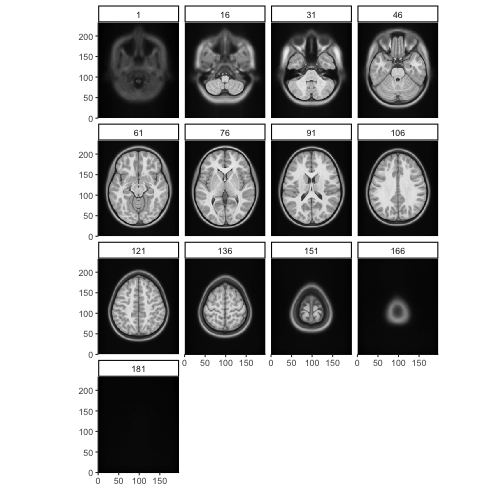

## Reading a NIFTI formatted image volume

The way to read an volumetric image file is to use `read_vol`:


```r
    library(neuroim2)
#> Loading required package: Matrix
    file_name <- system.file("extdata", "global_mask.nii", package="neuroim2")
    vol <- read_vol(file_name)
```

## Working with image volumes

Information about the geometry of the image volume is shown here:


```r
    print(vol)
#> NeuroVol
#>   Type           : DenseNeuroVol 
#>   Dimension      : 64 64 25 
#>   Spacing        : 3.5  X  3.5  X  3.7 
#>   Origin         : 110  X  -110  X  -46.2 
#>   Axes           : Right-to-Left Posterior-to-Anterior Inferior-to-Superior
```


`read_vol` returns an object of class `NeuroVol` object which extends an R `array` and has 3 dimensions (x,y,z).


```r
    class(vol)
#> [1] "DenseNeuroVol"
#> attr(,"package")
#> [1] "neuroim2"
    
    is.array(vol)
#> [1] TRUE
    
    dim(vol)
#> [1] 64 64 25
    
    vol[1,1,1]
#> [1] 0
    
    vol[64,64,24]
#> [1] 0
```
    
Arithmetic can be performed on images as if they were ordinary `array`s:


```r
    
    vol2 <- vol + vol
    sum(vol2) == 2 * sum(vol)
#> [1] TRUE
    
    vol3 <- vol2 - 2*vol
    all(vol3 == 0)
#> [1] TRUE
```

A numeric image volume can be converted to a binary image as follows:


```r
    
    vol2 <- as.logical(vol)
    class(vol2)
#> [1] "LogicalNeuroVol"
#> attr(,"package")
#> [1] "neuroim2"
    print(vol2[1,1,1])
#> [1] FALSE
```

We can also create a `NeuroVol` instance from an `array` or `numeric` vector. First we consruct a standard R `array`:


```r
    x <- array(0, c(64,64,64))
```

Now we reate a `NeuroSpace` instance that describes the geometry of the image including, at minimum, its dimensions and voxel spacing.


```r
    bspace <- NeuroSpace(dim=c(64,64,64), spacing=c(1,1,1))
    vol <- NeuroVol(x, bspace)
    vol
#> NeuroVol
#>   Type           : DenseNeuroVol 
#>   Dimension      : 64 64 64 
#>   Spacing        : 1  X  1  X  1 
#>   Origin         : 0  X  0  X  0 
#>   Axes           : Left-to-Right Posterior-to-Anterior Inferior-to-Superior
```

We do not usually have to create `NeuroSpace` objects, because geometric information about an image is automatically determined from information stored in the image file header. Thus, `NeuroSpace` objects are usually copied from existing images using the `space` extractor function when needed:


```r
    vol2 <- NeuroVol((vol+1)*25, space(vol))
    max(vol2)
#> [1] 25
    space(vol2)
#> NeuroSpace
#>   Type           : NeuroSpace 
#>   Dimension      : 64 64 64 
#>   Spacing        : 1  X  1  X  1 
#>   Origin         : 0  X  0  X  0 
#>   Coordinate Transform : 1 0 0 0 0 1 0 0 0 0 1 0 0 0 0 1
```

## Writing a NIFTI formatted image volume

When we're ready to write an image volume to disk, we use `write_vol`


```r
    write_vol(vol2, "output.nii")
    
    ## adding a '.gz' extension results ina gzipped file.
    write_vol(vol2, "output.nii.gz")
```

We can also display a `NeuroVol` instance. Lets download an MNI image from the web and plot it.


```r
    temp <- tempfile()
    uri = "http://www.bic.mni.mcgill.ca/~vfonov/nihpd/obj1/nihpd_asym_07.5-13.5_nifti.zip"
    download.file(uri,temp)
    cmd <- paste("unzip ", "-d", dirname(temp), temp)
    system(cmd)
    vol <- read_vol(paste0(dirname(temp), "/nihpd_asym_07.5-13.5_t1w.nii"))
    
```

Now we can display it using the `plot` command. We will show every 15th slice.


```r
   plot(vol, zlevels=seq(1, dim(vol)[3], by=15))
```



